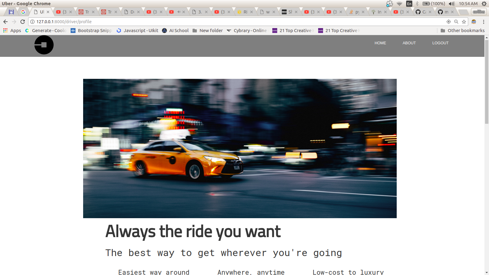
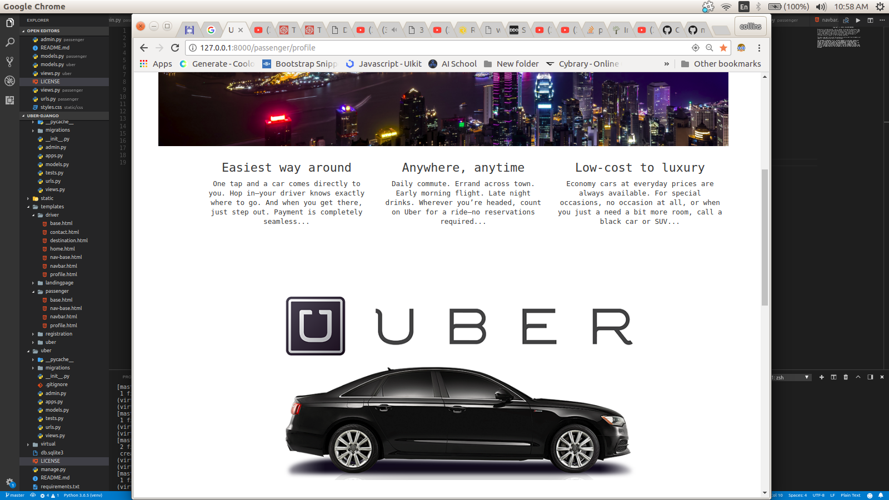
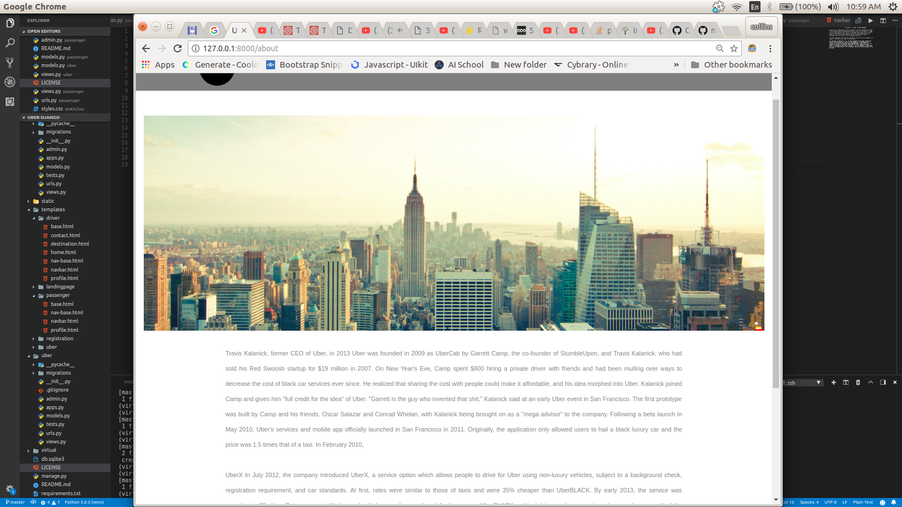

#                                                       UBER.

#                                                  WEBSITE DISPLAY.
# Website Layout

## - Full Screen layout

##      LANDING-PAGE

##        DRIVER APP

##     PASSENGER APP

## - Mid Size Screen layout

##      LANDING-PAGE

##        DRIVER APP

##     PASSENGER APP

##      ABOUT-PAGE

#  PROJECT DESCRIPTION

##  This is a clone to the uber app. Its an app where a people can car pool together if going to similar or close direction

## Author
Collins Kariuki

## Prerequisites
-You need to have nano text editor installed. you can find out whether you have it installed by typing nano --version in your terminal. For most linux distributions, it is installed by default. However, if you don't have it installed, you can quicky do that by typing sudo apt-get install nano in your terminal.

-You need to have (python3.6) installed in your machine

-Python3.6. Installation ($ sudo apt-get install python3.6).

-Django1.11. Installation ($ pip install django==1.11).

-Psycopg2. Installation ($ pip install psycopg2).

-Bootstrap3. Installation ($ pip install django-bootstrap3).

-Pillow. Installation ($ pip install pillow).

# Setup/Installation Requirements

-Internet connection

-webpage URL:

-To get to this webpage fist you need to get to my github repository

-You will need a database if you are to clone this app-: to avoid this you can visit deployed app mentioned in the Deployment section. 
However you could clone to run it on your own. follow the below instructions

-The link to my github Repository is: https://github.com/zecollokaris

-from there you can access the project

-git clone project

-install dependancies in requirements.txt file pip install -r requirements.txt

-cd into project

-create a virtual environment ($ python3.6 -m venv virtual)

-Activate Virtual Environmrnt. ($ source virtual/bin/activate)

-Run The Project-: ($ python manage.py runserver)

#{follow the above instructions for set up}

# Deployment

To get deployed application, please follow-:

#Technologies Used

-HTML5

-CSS

-JAVASCRIPT(hiding and revealing navbar on scroll)

-Bootstarap

-Python3.6

-Django 2.0.7(latest version 2018)

-Psycopg2

-PostgreSQL

# Support and Contact

-Mobile number: (+254) 798731203

-Email Address: collo.kariss@gmail.com

-github-username: zecollokaris

## License
The app is licensed by MIT.

Collins Kariuki - MIT (c)2018 LICENSE